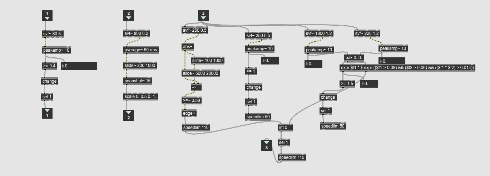
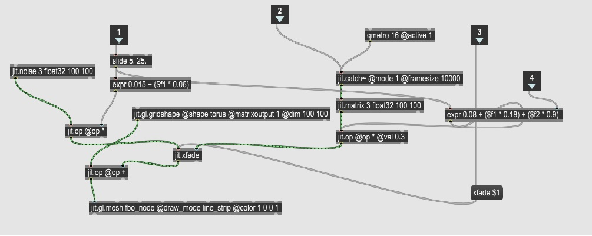
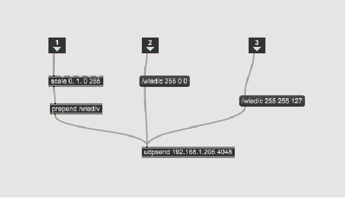
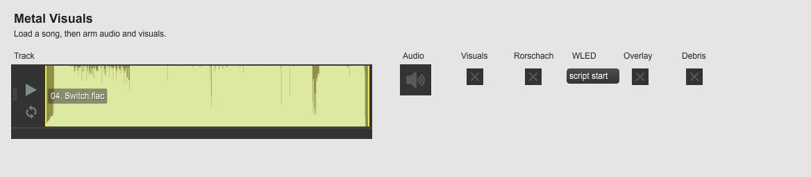

# Audio Visualizer in MAX/MSP cu integrare WLED
Aplicatia este un audio visualizer pentru muzica de tip rock/metal cu integrare [WLED](https://kno.wled.ge), ce prezinta atat un visualizer generat in aplicatie in functie de diferitele instrumente prezente intr-o melodie, dar si integrare cu WLED, o aplicatie open-source pentru control al luminilor LED.

## Pasi de instalare si dependente externe
1. Se instaleaza aplicatia [MAX MSP 8/9](https://cycling74.com/downloads) ( compatibilitatea cu versiuni anterioare nu este verificata ).
2. Se instaleaza dependentele [CNMAT Externals](https://cycling74.com/packages/cnmat-externals), sau direct din package manager-ul aplicatiei MAX.
3. **optional - integrare WLED** Modul compatibil WLED cu suport pentru protocolul DDP. Un exemplu : [controller](https://www.wifistore.ro/cumpara/controler-inteligent-gledopto-gl-c-211wl-wi-fi-pwm-wled-pentru-benzi-125142?utm_source=portal&utm_medium=web&utm_campaign=google_xml&gad_source=1&gad_campaignid=22591662394&gclid=CjwKCAjwzevPBhBaEiwAplAxvuhdfeAYuVsK8ktMdyWnlyRsWtULtT98OvBPPOg5_eOYPGzWPKQ7-RoC0IEQAvD_BwE)
4. **optional - banda LED RGB sau RGB(W)** Se poate utiliza orice banda led din cele doua tipuri mentionate, iar pentru instalare se urmeaza pasii dati de producatorul modului WLED . 

## (Utilizare)
1. Se ruleaza script-ul principal **_MAIN_MetalVis** in MAX si se trece in "Presentation Mode".
2. **optional - integrare WLED** Se verifica conexiunea WLED in scriptul principal de MAX, prin accesarea ip-ului modulului mentionat anterior (hostname-ul specific) intr-un browser si daca coincide cu cel prezent in script, daca nu, se schimba la cel corect.
3. Se incarca in modulul playlist~ o melodie la alegere prin drag-and-drop sau se alege din cele ce se gasesc in folder-ul songs al proiectului pe care le-am pus la dispozitie(3 melodii ce au mix-uri diferite, cu detectie de la cel mai greu caz - switch.flac, la cel mai usor caz - this means war.flac)
4. Se da start la melodie si se observa vizualizatorul integrat si/sau jocul de lumini oferit de banda LED, pornind script-ul WLED din butonul script_start.
5. Pentru o demonstratie, se poate urmari link-ul [DEMO VIDEO](https://youtu.be/b4P4oEX60sQ).

## (Dezvoltare)
1. Detectia generala a kick-ului, a snare-ului si a BPM-ului melodiei se face utilizand fisierul audio_engine.maxpat, aici se afla o colectie de filtrari.

Aici se pot observa 3 inlet-uri, 1 - detectia kick, 2 - detectia chitara + energia melodiei, 3 - detectia snare. Detectia kick-ului se bazeaza pe frecventele joase si pe anumite praguri, iar detectia snare-ului este mai complexa fiind nevoie de mai multa atentie asupra acestuia, pentru ca frecventele specifice se intrepatrund cu cele pentru hi-hat-uri, chitara si voce. De aceea am utilizat mai multe metode pentru detectia cum ar fi : tranzienti + detectie corp + detectie "crack", varianta finala combinand aceste 3 metode pentru a evita pe cat de mult posibil detectia falsa ( la momentul actual exista o detectie de aproximativ 80%)

2. Fisierul mesh_deformer se ocupa cu visualizer-ul prezent in proiect.

3. Fisierul wled_controller.maxpat este varianta de test utilizata pentru prima iteratie de control WLED.

4. Script-ul JS ddp_udp_sender.js este varianta finala prin care se face comunicarea directa prin DDP cu modulul WLED. Comportamentul luminilor este in felul urmator : pulseaza rosu pe kick-uri, iar pe snare se face tranzitia catre un flash alb.

5. Fisierul _MAIN_MetalVis.maxpat este fisierul principal al proiectului, caruia i-am creat "Presentation Mode", unde se pot observa exact butoanele importante.

## (Istoric)

(06.05) Am prototipat aplicatia initiala ce raspunde la doua instrumente : 
1. Toba "kick" ce face camera sa se miste pe axele XoY si toba "snare" ce face sa apara un flash alb in background.
2. Chitara ce adauga chromatic aberation pe cercul central al visualizer-ului.

(25.05) Update major: 
1. Efecte multiple ce pot fi utilizate sau nu dupa necesitatea utilizatorului.
2. Detectie snare imbunatatita.
3. Integrare WLED prin DDP.

(16.06) Update major + optimizari: 
1. Integrare WLED prin DDP completa.
2. Detectie Snare complexa.
3. Optimizari la filtrele utilizate pentru un timp de raspuns mai rapid.

## (Link-uri)
1. [MAX MSP 8/9](https://cycling74.com/downloads)
2. [CNMAT Externals](https://cycling74.com/packages/cnmat-externals)
3. [WLED](https://kno.wled.ge)
4. [controller](https://www.wifistore.ro/cumpara/controler-inteligent-gledopto-gl-c-211wl-wi-fi-pwm-wled-pentru-benzi-125142?utm_source=portal&utm_medium=web&utm_campaign=google_xml&gad_source=1&gad_campaignid=22591662394&gclid=CjwKCAjwzevPBhBaEiwAplAxvuhdfeAYuVsK8ktMdyWnlyRsWtULtT98OvBPPOg5_eOYPGzWPKQ7-RoC0IEQAvD_BwE)
5. [DEMO VIDEO](https://youtu.be/b4P4oEX60sQ)

# Dezvoltarea proiectului

Pentru început:

1. Creează-ți cont pe Github
2. Download și install [Github Desktop](https://desktop.github.com/)
3. Citește [acest ghid](https://charlesmartin.com.au/blog/2020/08/09/student-project-repository) și ține la îndemână [Markdown Cheat Sheet](https://www.markdownguide.org/cheat-sheet).

Apoi, procesul este următorul (inspirat de [aici](https://cs.anu.edu.au/courses/comp1720/deliverables/05-major-project/#submission-process)):

1. *fork* al acestui template către propriul tău cont de Github

_(dacă preferi cumva ca repo-ul să nu fie vizibil de către public, îl poți seta ca Private din Settings - "Change visibility". Atunci trebuie să mă adaugi drept colaborator, ca eu să am acces.)_

2. *clone* al repo-ului din Github Desktop pentru a-l downloada local

3. *commit* și *push* pe măsură ce lucrezi la proiect. Ultima versiune push-ată pe server înainte de deadline va conta pentru evaluare.

## Elemente obligatorii

1. Acest readme completat. Titlu, descriere, mod de utilizare, istoric, link-uri utile.

   Poți include și imagini și chiar [gif-uri animate](https://www.screentogif.com/), sau link-uri către materiale audio/video.
   
   Vezi [aici](https://charlesmartin.com.au/blog/2020/08/09/student-project-repository) mai multe sugestii.

2. [Declarația de originalitate](statement-of-originality.yml) completată. Tot ce nu este inclus acolo va fi considerat 100% contribuție proprie.

    *(formatul este adaptat de [aici](https://gitlab.cecs.anu.edu.au/comp1720/2018/comp1720-2018-major-project/-/blob/master/statement-of-originality.yml). Da, este un pic ironic să refolosim un doc [de altundeva](https://cs.anu.edu.au/courses/comp1720/resources/faq/#how-do-i-fill-out-my-statement-of-originality), dar menționăm sursa deci nu este plagiat!)*

3. Proiectul în sine. Tot codul trebuie să fie prezent, proiectul trebuie să poată rula conform instrucțiunilor din readme. Dacă e nevoie de asset-uri mari (sunete, video etc), [folosește Git LFS](https://git-lfs.github.com/) sau include link de download în instrucțiunile de instalare.

